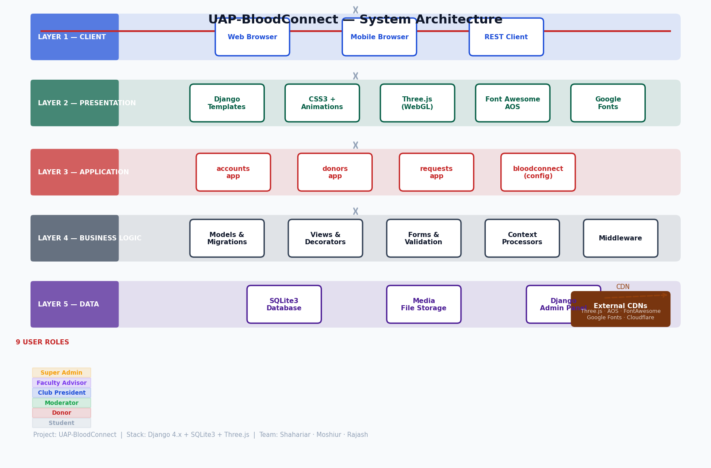
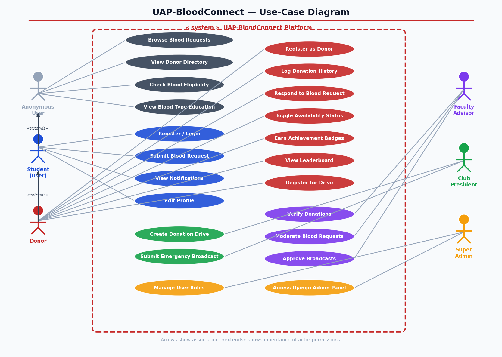
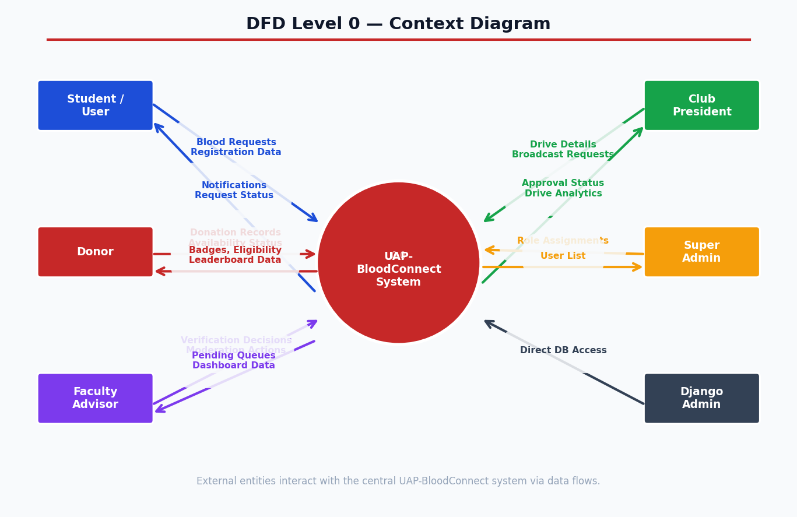
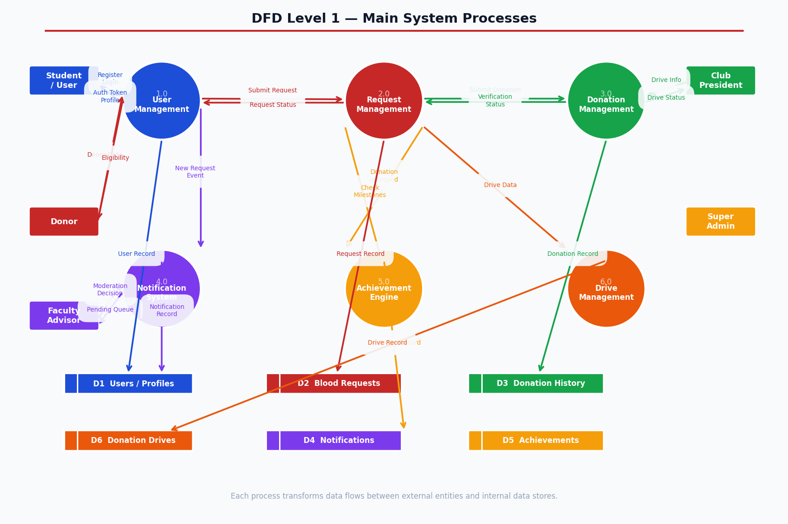
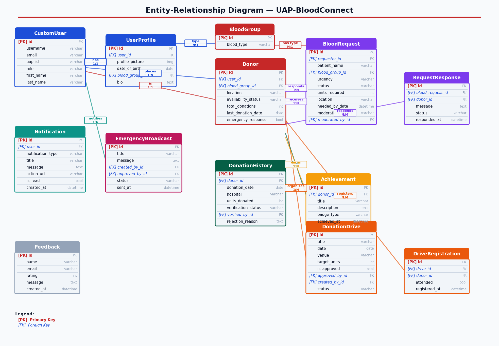
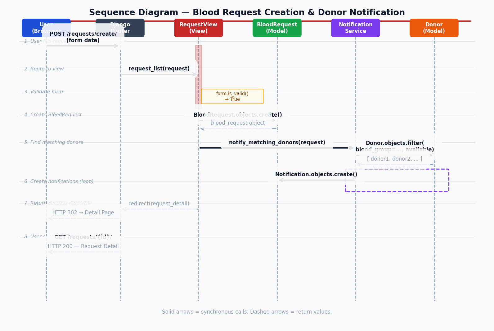
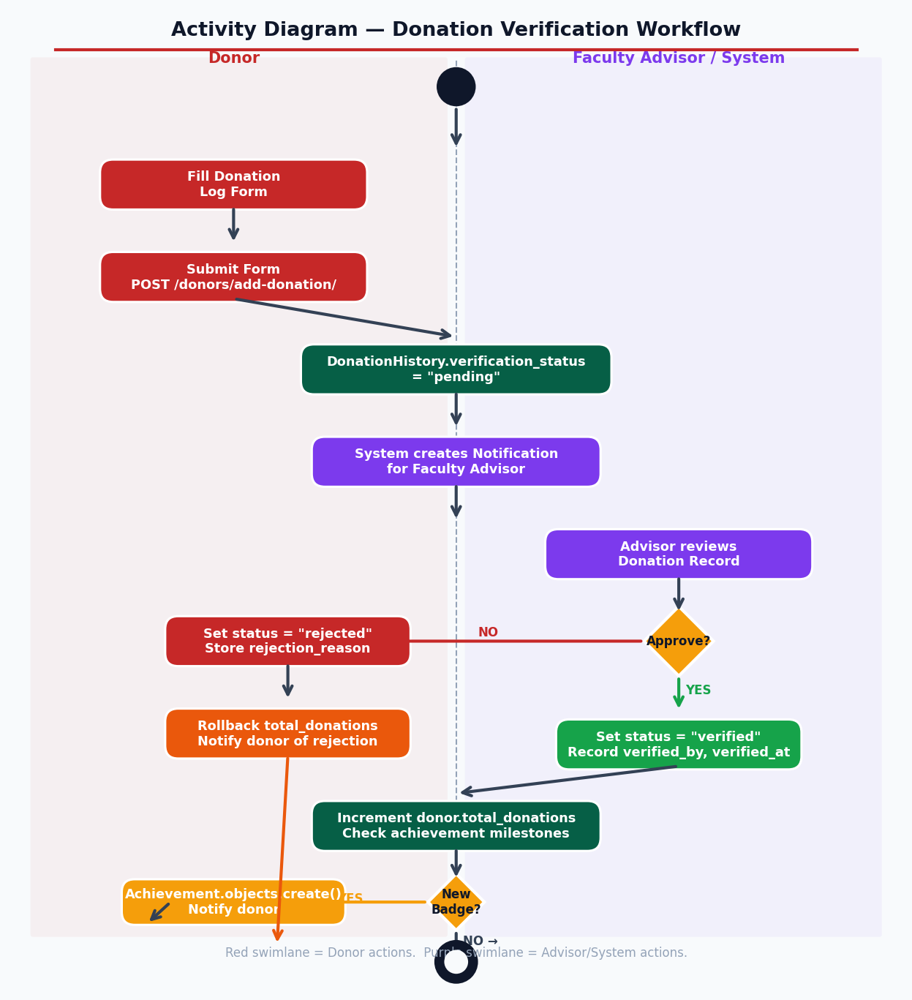
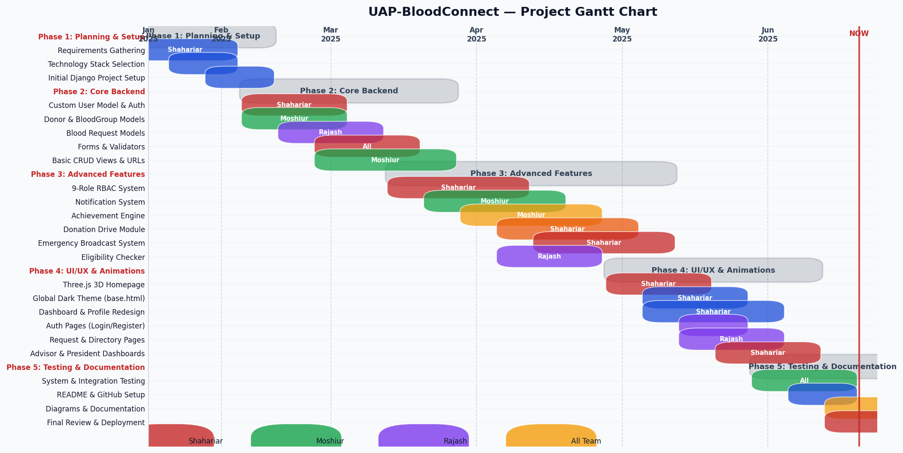

# UAP-BloodConnect

**A university-grade blood donation management platform for the University of Asia Pacific (UAP)**

[](https://python.org)
[](https://djangoproject.com)
[](https://sqlite.org)
[](LICENSE)

---

## Overview

UAP-BloodConnect is a full-stack web platform that connects blood donors with recipients within the University of Asia Pacific community. It replaces fragmented WhatsApp/Facebook group requests with a structured, role-managed system featuring real-time notifications, donation tracking, achievement badges, and a multi-tier administrative workflow.

> Built by students, for students — every drop counts.

---

## Features

### For Donors
- Register as a blood donor with blood group, location, and availability status
- Log donations and track your full donation history
- Earn achievement badges (Bronze → Silver → Gold → Platinum → Blood Hero)
- Live eligibility countdown (90-day interval tracker)
- Personal leaderboard ranking within the UAP community
- Emergency response toggle for critical situations

### For Recipients
- Submit blood requests with urgency level (Low / Medium / High / Critical)
- Automatic notification to matching available donors
- Real-time request status tracking (Open → In Progress → Fulfilled)
- Supporting document upload for medical verification

### For Administrators
| Role | Panel | Capabilities |
|---|---|---|
| **Faculty Advisor** | `/accounts/advisor/` | Verify donations, moderate blood requests, approve drives & broadcasts |
| **Club President** | `/accounts/president/` | Create donation drives, submit emergency broadcasts |
| **Moderator** | (via Advisor panel) | Moderate blood request visibility |
| **Super Admin** | `/accounts/manage-roles/` | Assign and manage all user roles |
| **Django Admin** | `/admin/` | Full database access |

### Platform
- Emergency broadcast system with approval workflow
- Donation drive creation and management (registration, attendance)
- Donor directory with blood type and location filters
- Blood type education and compatibility guide
- Eligibility checker tool
- In-app notification system (achievements, new requests, matches)
- Feedback / contact system

---

## Tech Stack

| Layer | Technology |
|---|---|
| Backend | Django 4.x (Python 3.12) |
| Database | SQLite3 (dev) |
| Frontend | Django Templates, CSS3 (glassmorphism, dark theme) |
| 3D Graphics | Three.js r128 (WebGL hero animation) |
| Animations | AOS (Animate On Scroll), CSS keyframes |
| Icons | Font Awesome 6.5 |
| Fonts | Google Fonts — Inter, Poppins |
| Auth | Django's built-in `AbstractUser` with 9-role RBAC |

---

## Role Hierarchy

```
9 — Super Admin       → Full platform control, role assignment
8 — Faculty Advisor   → Donation verification, request moderation
7 — Club President    → Drive management, emergency broadcasts
6 — IT Manager        → (reserved)
5 — Moderator         → Content moderation support
4 — Management        → Attendance marking, drive coordination
3 — Medical Staff     → (reserved)
2 — Donor             → Blood donations, request responses
1 — Student (default) → Blood requests, browsing
```

---

## Project Structure

```
UAP-BloodConnect/
├── accounts/           # Custom user model, auth, role decorators, dashboards
│   ├── models.py       # CustomUser (AbstractUser), UserProfile
│   ├── views.py        # register, profile, edit_profile, advisor/president dashboards
│   ├── decorators.py   # @advisor_required, @president_required, etc.
│   └── templates/
├── donors/             # Donor profiles, donations, achievements, drives
│   ├── models.py       # Donor, BloodGroup, DonationHistory, Achievement, DonationDrive
│   ├── views.py        # dashboard, leaderboard, directory, drive CRUD
│   └── templates/
├── requests/           # Blood request lifecycle, notifications, broadcasts
│   ├── models.py       # BloodRequest, RequestResponse, EmergencyBroadcast, Notification
│   ├── views.py        # request list/detail/create, respond, notifications
│   └── templates/
├── bloodconnect/       # Project settings, URL root, context processors
│   ├── settings.py
│   ├── urls.py
│   └── context_processors.py   # unread_count for notification bell
└── templates/          # Global templates: base.html, home.html, about.html, etc.
```

---

## Getting Started

### Prerequisites
- Python 3.10+
- pip

### Installation

```bash
# Clone the repository
git clone https://github.com/turtle-xo7/UAP-BloodConnect.git
cd UAP-BloodConnect

# Create and activate a virtual environment
python -m venv venv
# Windows:
venv\Scripts\activate
# macOS/Linux:
source venv/bin/activate

# Install dependencies
pip install -r requirements.txt

# Apply database migrations
python manage.py migrate

# Create a superuser (for Django admin + Super Admin role)
python manage.py createsuperuser

# Run the development server
python manage.py runserver
```

Open your browser at **http://127.0.0.1:8000**

---

## Accessing Admin Panels

### Django Admin (full database access)
```
URL:      http://127.0.0.1:8000/admin/
Username: (your superuser credentials)
Password: (set during createsuperuser)
```

### Custom Role-Based Panels

The custom dashboards are accessed **through the main site** — they are not separate login screens.

1. **Register or log in** at `/accounts/register/` or `/accounts/login/`
2. **Assign a role** via Django Admin:
   - Go to `/admin/` → **Accounts → Custom users** → select the user → change the `Role` field
3. **Log back in** to the main site — the appropriate panel link will appear in the navbar:

| Role assigned | Navbar link | Panel URL |
|---|---|---|
| Faculty Advisor (8) | Purple "Advisor" | `/accounts/advisor/` |
| Club President (7) | Indigo "President" | `/accounts/president/` |
| Super Admin (9) | Gold "Roles" | `/accounts/manage-roles/` |

> Alternatively, a Super Admin user can assign roles to others via the **Roles** panel at `/accounts/manage-roles/` without touching Django Admin.

---

## Seeding Initial Data

To bootstrap blood groups and test donors:

```bash
python manage.py shell
```

```python
from donors.models import BloodGroup
for bt in ['A+', 'A-', 'B+', 'B-', 'O+', 'O-', 'AB+', 'AB-']:
    BloodGroup.objects.get_or_create(blood_type=bt)
```

---

## Screenshots

| Page | Description |
|---|---|
| Home | Three.js 3D blood drop hero, dark animated background, blood inventory tubes |
| Dashboard | Donor stats, achievement badges, donation history |
| Blood Requests | Glassmorphism cards with urgency indicators |
| Leaderboard | Animated podium, ranked donor table |
| Donor Directory | Grid of donor cards with availability rings |
| Advisor Dashboard | Tabbed moderation queues |

---

## Key Design Decisions

- **Dark-first design**: All pages use `#080e1a` background with glassmorphism cards (`backdrop-filter: blur()`) for a consistent, modern look across all screens.
- **Role RBAC via integer field**: A single `role` integer on `CustomUser` drives all permission checks through property methods (`is_faculty_advisor`, `is_club_president`, etc.).
- **Two-step approval for sensitive actions**: Donations → verified by advisor. Blood requests → moderated before donors are notified. Broadcasts → approved before sending.
- **90-day donation interval**: Enforced in the eligibility checker and displayed as a countdown on the donor dashboard.

---

## System Diagrams

### Architecture Overview


### Use-Case Diagram


### Data Flow — Level 0 (Context Diagram)


### Data Flow — Level 1


### Entity-Relationship Diagram


### Sequence Diagram — Blood Request Flow


### Activity Diagram — Donation Verification


### Gantt Chart — Project Timeline


> Diagrams generated from [`docs/diagrams/generate_diagrams.py`](docs/diagrams/generate_diagrams.py)

---

## Contributing

Pull requests are welcome. For major changes, open an issue first to discuss the proposed change.

1. Fork the repo
2. Create a feature branch (`git checkout -b feature/your-feature`)
3. Commit your changes (`git commit -m 'Add some feature'`)
4. Push to the branch (`git push origin feature/your-feature`)
5. Open a Pull Request

---

## Team

Built by the students of the **Department of Computer Science & Engineering**, University of Asia Pacific.

| Name | Role | Responsibilities |
|---|---|---|
| **Mohammad Shahariar** | Project Lead & Full-Stack Developer | System architecture, RBAC role system, all dashboards (advisor/president/super admin), 3D animated UI, dark theme, deployment |
| **Shad Bin Moshiur** | Backend Developer | Core Django models, donation/request logic, notification system, achievement engine, eligibility checker |
| **Rajash Majumdar** | Frontend Developer | Blood request pages, about page, UI components, form design, blood type education |

---

## License

This project is licensed under the MIT License — see the [LICENSE](LICENSE) file for details.

---

<div align="center">
  <sub>UAP-BloodConnect — Saving lives through community &nbsp;|&nbsp; University of Asia Pacific &copy; 2025</sub>
</div>
